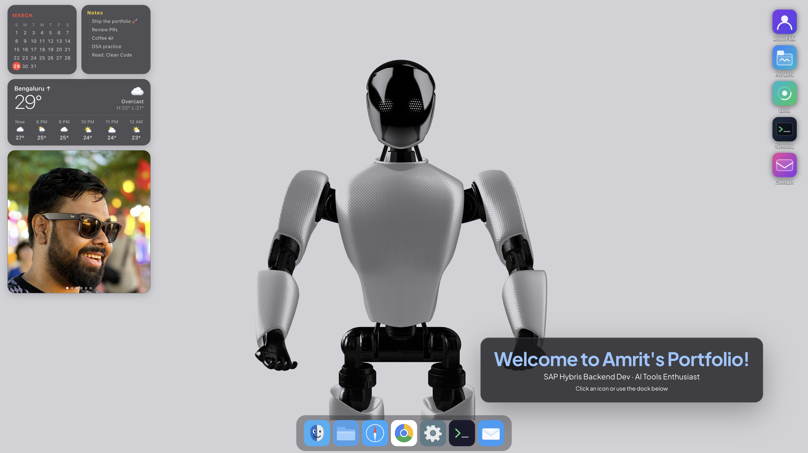

<div align="center">

# 🖥️ Amrit's macOS Portfolio

### A macOS desktop simulator built as a personal portfolio

[](https://amrit-portfolio-macos.vercel.app)
[](https://react.dev)
[](https://www.typescriptlang.org)
[](https://vitejs.dev)

</div>

---



---

## 👤 About Me

**Amrit** — DC Consultant & Senior Backend Engineer at **Deloitte**

Specialising in SAP Commerce Cloud (Hybris), Java Spring Boot microservices, and scalable B2B/B2C e-commerce platforms. Passionate about AI adoption, clean architecture, and building things that perform at scale.

- 📍 Bengaluru, India
- 💼 [LinkedIn](https://www.linkedin.com/in/amrit001/)
- 📝 [Medium](https://medium.com/@amrit.01sinha)
- 📧 amrit.01sinha@gmail.com

---

## 🚀 Features

| Feature | Description |
|---|---|
| 🖥️ **macOS Desktop** | Fully draggable, resizable windows with traffic-light controls |
| 🔒 **Boot Animation** | macOS-style lock screen with auto-fill password on load |
| 🤖 **Spline 3D** | Interactive 3D robot rendered on the desktop |
| 🔍 **Finder / About Me** | Resume, certifications, education & experience |
| 📁 **Projects** | Filterable project browser with sidebar tags |
| ⚡ **Skills** | Skill bars across Backend, DevOps, E-Commerce, Data, Architecture |
| 💻 **Terminal** | Fully functional CLI with `about`, `skills`, `projects`, `neofetch` & more |
| 📬 **Contact** | Email composer powered by EmailJS |
| 🌤️ **Weather Widget** | Live Bengaluru weather via Open-Meteo API |
| 📅 **Calendar Widget** | iOS-style calendar with month navigation |
| 📝 **Notes Widget** | Add/edit/delete notes with localStorage persistence |
| 🖼️ **Photo Carousel** | Auto-playing carousel with lightbox viewer |
| 🌙 **Dark / Light Mode** | Toggle via Control Centre in the menu bar |
| 📱 **Responsive** | Full mobile & tablet support |

---

## 💼 Experience

### DC Consultant – Senior Backend Engineer
**Deloitte** · June 2024 — Present

- Delivered 50+ REST APIs on SAP Commerce Cloud (CCv2 v2211) processing **100K+ daily transactions** with 99.9% uptime; reduced response times by **35%** via query & caching optimisation
- Spearheaded technical design and feature ownership, cutting delivery cycles by **25%** and achieving **95% SLA compliance** with 30% faster incident resolution
- Mentored 4 developers through code reviews, improving code quality by **40%** (SonarQube metrics)
- Driving project-wide AI adoption — created guardrails and rulesets for LLM models for standardised code generation and issue resolution

### DC Analyst – Backend Engineer
**Deloitte** · September 2021 — June 2024

- Migrated SAP Commerce from On-Premise (v1905) to CCv2 and upgraded to v2211 with **zero downtime** for 50K+ SKU catalog; SQL optimisation improved data processing by **45%**
- Built 20+ backend services using Java Spring Boot for a B2C platform supporting **500K+ monthly active users**
- Developed Solr, Promotions, and Order Management modules increasing conversion rate by **18%**; delivered 10+ features with **98% defect-free rate**

---

## 🛠️ Tech Stack

### Portfolio


### Professional Skills


---

## 📂 Featured Projects

| Project | Description | Stack | Status |
|---|---|---|---|
| **Caterpillar ONE** | Global B2B e-commerce platform | SAP Commerce, Java, CCv2 | 🟡 In Progress |
| **Audio Auto-Translator** | Real-time voice translation, 100+ languages | Next.js, FastAPI, Whisper, WebSocket | 🟢 Live |
| **Sentiment Analysis Dashboard** | Production ML dashboard, F1 >0.75, 10K+ preds/sec | Next.js, FastAPI, scikit-learn, Redis | 🟢 Live |
| **Stoic Penguin Path Tracker** | Interactive visual metaphor for stoic independence | Python, Visualisation | 🟢 Live |
| **Shane Co.** | B2C jewellery platform, 500K+ MAU | SAP Commerce, Java, Spartacus, Solr | ⚫ Archived |
| **EoMM CCv2 Migration** | On-prem → CCv2 migration, 40% perf gain | SAP Commerce, HANA DB, Jenkins | ⚫ Archived |

---

## 🏆 Certifications

- **SAP Certified Associate** – SAP Commerce Cloud Business User
- **AWS Cloud Practitioner** *(in progress)*

---

## 🖥️ Run Locally

```bash
git clone https://github.com/D3stroy3rX9/portfolio-macos.git
cd portfolio-macos
npm install
npm run dev
```

Create `.env.local` for the contact form:
```env
VITE_EMAILJS_SERVICE_ID=your_service_id
VITE_EMAILJS_TEMPLATE_ID=your_template_id
VITE_EMAILJS_PUBLIC_KEY=your_public_key
```

---

<div align="center">

Built with React + Vite · Deployed on Vercel

**[amrit-portfolio-macos.vercel.app](https://amrit-portfolio-macos.vercel.app)**

</div>
